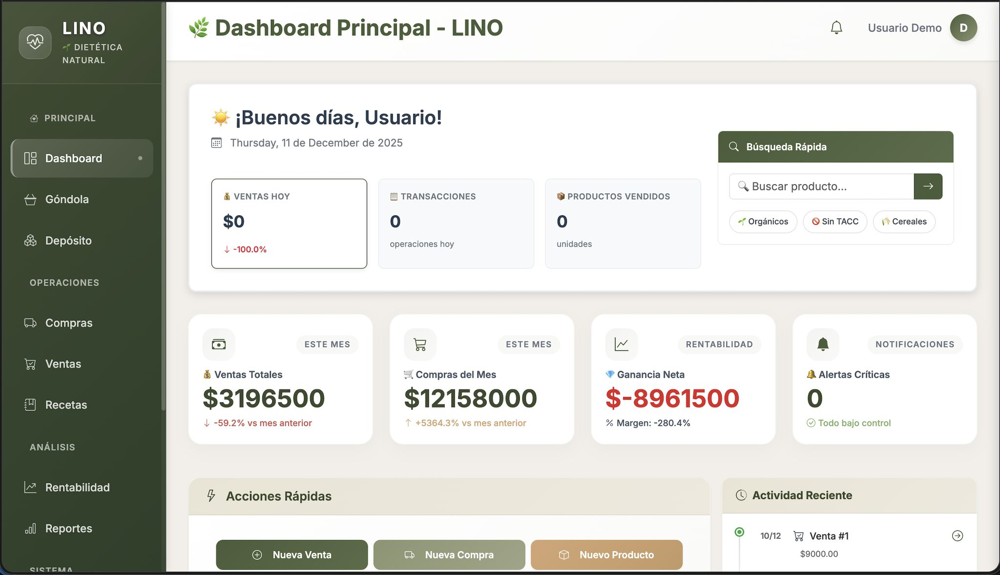
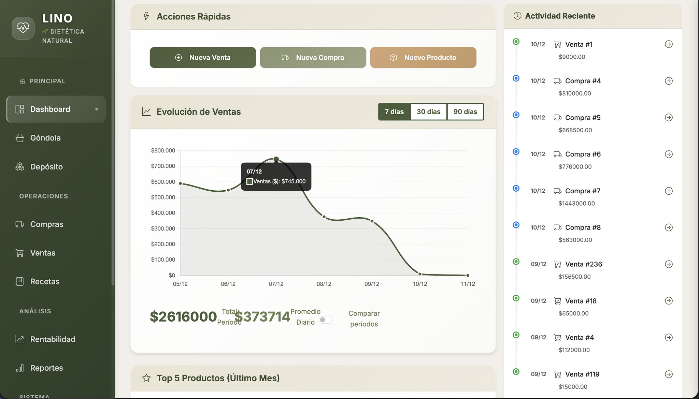
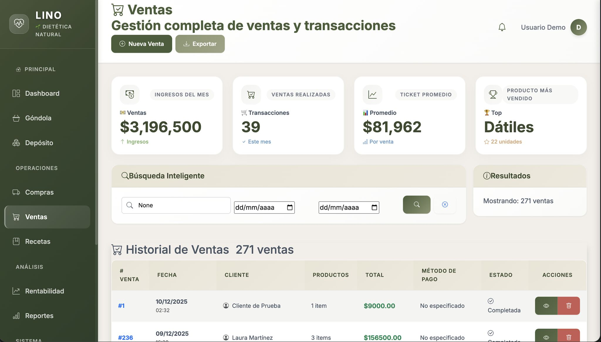
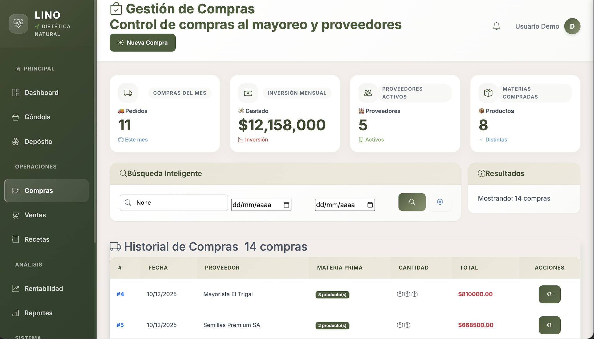
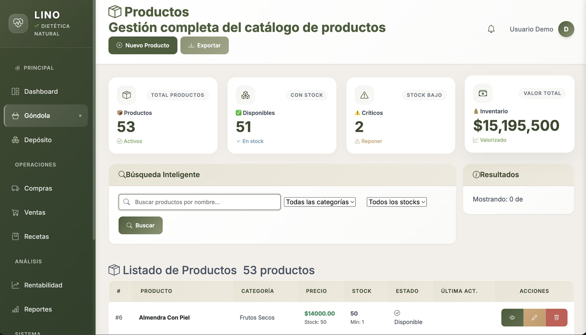
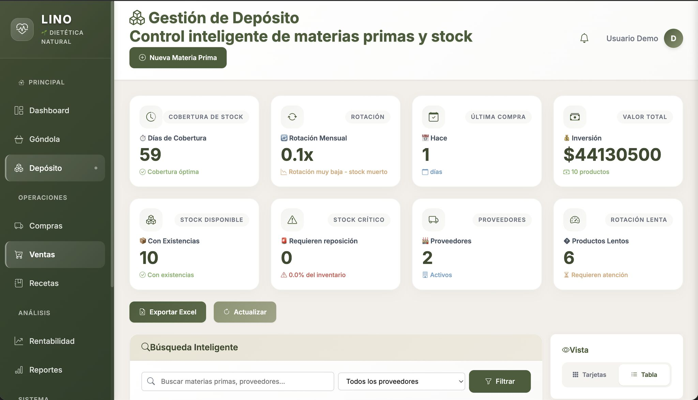
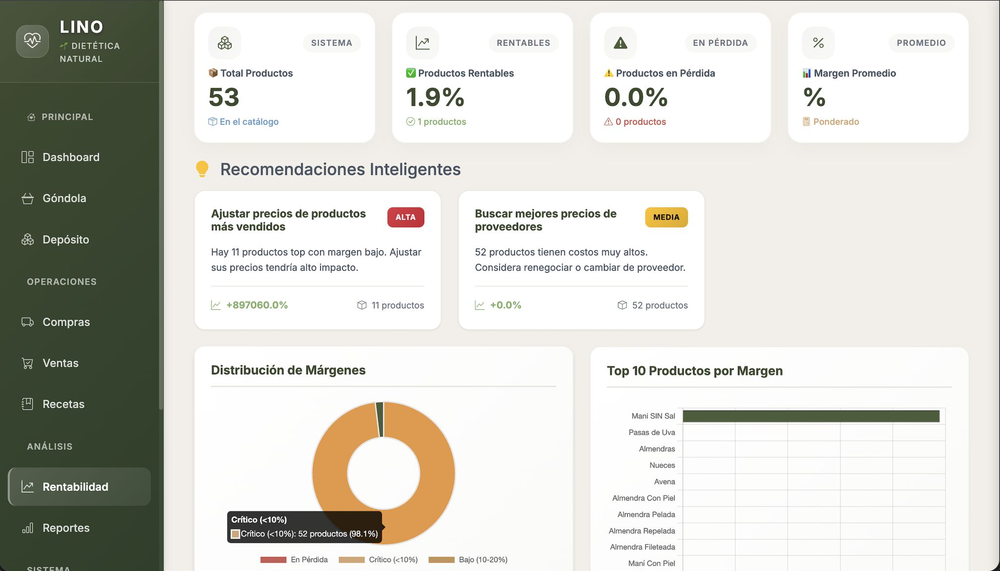
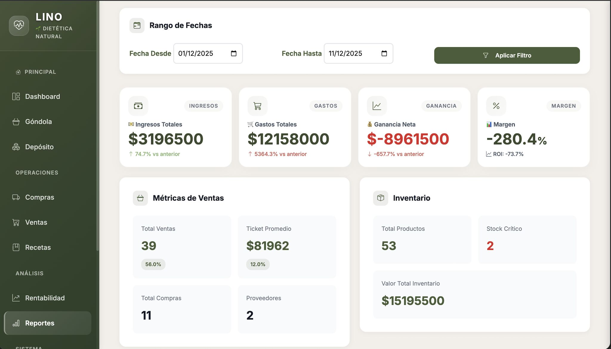
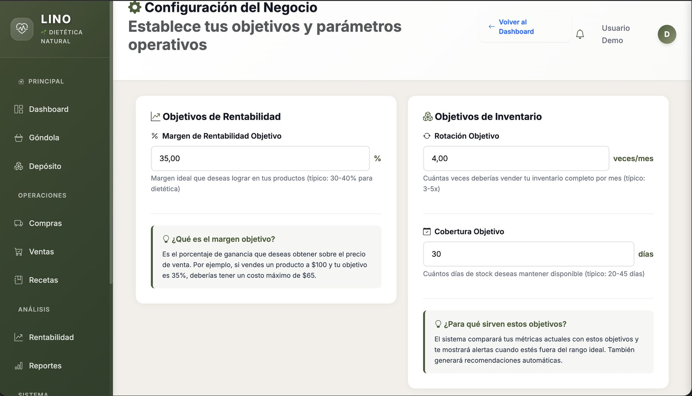

# Lino Saludable — Sistema de Gestión Integral

ERP web construido con Django 5.2 para un negocio real de frutos secos y dietética natural en Córdoba, Argentina. En producción desde diciembre 2024 con más de 1.800 transacciones registradas.

Proyecto end-to-end: modelado de datos, lógica de negocio en capa de servicios, API interna, CI con GitHub Actions y deploy continuo en Railway.


---

## Screenshots

### Dashboard Principal


### Evolución de Ventas con Chart.js


### Módulo de Ventas


### Gestión de Compras al Mayoreo


### Catálogo de Productos (Góndola)


### Control de Depósito e Inventario


### Análisis de Rentabilidad con Recomendaciones Automáticas


### Reportes por Período


### Configuración de Objetivos del Negocio


---

## Stack

| Capa | Tecnología |
|------|-----------|
| Backend | Django 5.2, Python 3.13 |
| Base de datos | PostgreSQL (producción) · SQLite (desarrollo) |
| Frontend | Bootstrap 5, Chart.js, HTML/CSS/JS vanilla |
| Infraestructura | Railway, Gunicorn, WhiteNoise, Nixpacks |
| Seguridad | django-axes, HSTS, CSP, CSRF, cookies seguras |
| Testing | pytest, pytest-django, Playwright (E2E) |
| CI/CD | GitHub Actions |
| Exportación | django-import-export, openpyxl, reportlab |

---

## Funcionalidades

### Operación diaria
- **Ventas** con cálculo automático de totales y márgenes
- **Compras al mayoreo** con cálculo de precio por kilogramo y actualización de stock
- **Productos y materias primas** con control de stock, stock mínimo y vencimientos
- **Recetas**: composición de productos elaborados a partir de materias primas con costeo automático

### Inteligencia de negocio
- **Dashboard** con métricas en tiempo real (ventas del día, márgenes, top productos)
- **Analytics de rentabilidad** por producto, categoría y período con recomendaciones automáticas
- **Reportes** configurables por rango de fechas, exportables a Excel/PDF
- **Gráficos de tendencias** interactivos con Chart.js

### Sistema de alertas (7 tipos)
`stock_agotado` · `stock_crítico` · `vencimiento_próximo` · `margen_negativo` · `margen_bajo` · `stock_muerto` · `oportunidad_de_venta`

Cada alerta tiene nivel de severidad (`danger` / `warning` / `info` / `success`) y es generada por servicio dedicado o comando programado.

### Plataforma
- **API JSON interna** (`/api/productos/`, `/api/inventario/`, `/api/ventas/`) para llamadas AJAX
- **Soft delete con auditoría** — los datos reales nunca se destruyen
- **Backups diarios automáticos** vía cron en Railway (3 AM UTC)
- **Deploy continuo**: cada push a `main` se despliega automáticamente

---

## Arquitectura

App única `gestion` con responsabilidades divididas por archivo:

```
src/
├── gestion/
│   ├── views.py              # dashboard, reportes, alertas
│   ├── views_ventas.py       # CRUD de ventas
│   ├── views_compras.py      # CRUD de compras
│   ├── views_productos.py    # productos y materias primas
│   ├── views_recetas.py      # recetas
│   ├── api.py                # endpoints JSON
│   ├── models.py             # modelos + managers
│   ├── services/
│   │   ├── alertas_service.py
│   │   ├── analytics_service.py
│   │   ├── dashboard_service.py
│   │   ├── inventario_service.py
│   │   ├── marketing_service.py
│   │   └── rentabilidad_service.py
│   └── management/commands/  # generar_alertas, backup_db, cargar_ejemplo_simple
├── lino_saludable/
│   ├── settings.py           # desarrollo + detección de entorno
│   └── settings_production.py
└── manage.py
```

### Decisiones técnicas destacadas

**Services layer** — la lógica de negocio no vive en las vistas. Cada módulo tiene su servicio dedicado, testeable en aislamiento.

**Managers personalizados** — `VentaActivaManager` es el manager por defecto y filtra soft-deletes; `VentaManager` expone todos los registros para auditoría.

**Decimal estricto** — todos los campos monetarios usan `DecimalField`. Prohibido `float()` en operaciones de negocio para evitar errores de precisión.

**Signals desactivados intencionalmente** — `signals.py` documenta por qué los handlers están deshabilitados (prevención de operaciones duplicadas en cadenas de save).

**Índices en campos críticos** — `fecha`, `eliminada`, `usuario` en ventas, pensado para queries de reportes sobre miles de filas.

---

## Setup local

```bash
git clone https://github.com/giuliano-z/lino-saludable-erp.git
cd lino-saludable-erp

python3 -m venv venv
source venv/bin/activate  # Windows: venv\Scripts\activate
pip install -r requirements.txt

cp .env.example .env  # editar con tus valores

cd src
python manage.py migrate
python manage.py createsuperuser
python manage.py cargar_ejemplo_simple  # datos de prueba (opcional)
python manage.py runserver
```

App en `http://localhost:8000` · Admin en `http://localhost:8000/admin`

### Variables de entorno mínimas

```env
SECRET_KEY=tu-secret-key-aqui
DEBUG=True
DATABASE_URL=sqlite:///db.sqlite3
ALLOWED_HOSTS=localhost,127.0.0.1
```

---

## Tests

```bash
pytest                        # toda la suite
pytest src/gestion/tests/     # solo unit tests
pytest tests_e2e/ -m e2e      # E2E con Playwright
pytest -m "not e2e"           # excluir E2E
```

CI corre la suite completa en cada push/PR a `main` y `develop` (`.github/workflows/django_ci.yml`).

---

## Deploy

Configurado en `railway.toml`. Secuencia de arranque en cada deploy:

1. `migrate` — aplica migraciones pendientes
2. `createusers` — asegura usuarios de sistema
3. `resetpasswords` — rota credenciales desde variables de entorno
4. `gunicorn` — 2 workers, timeout 60s

Cron diario a las 3 AM UTC: `backup_db` dumpea la base y la envía por mail.

### Seguridad en producción
- HSTS + `SECURE_SSL_REDIRECT` + cookies seguras
- Content Security Policy + `X-Frame-Options`
- django-axes: bloqueo tras 5 intentos fallidos en 1 hora
- `SECRET_KEY` y credenciales siempre en variables de entorno, nunca en el repositorio

---

## Autor

**Giuliano Daniel Zulatto**

[LinkedIn](https://linkedin.com/in/giuliano-zulatto) · [GitHub](https://github.com/giuliano-z) · giulianodanielzulatto@gmail.com
